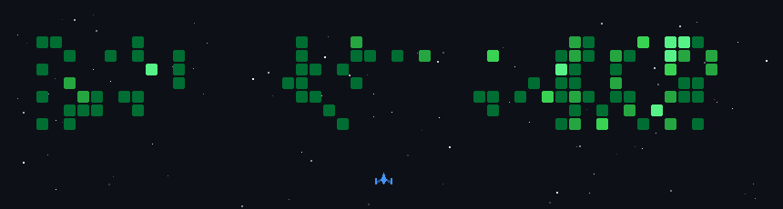

 
  

  <h1 align="center">Hi there, I'm <a href="https://www.shahilahamad.com.np/" target="_blank">Shahil Ahamad</a> </h1>

  

   

  

    
    
    
    
  

 

  <h2>⚡ About Me</h2>

<table align="center" border="0">
  <tr>
    <td width="55%" align="left">
      <ul>
        <li>🔭 I'm currently working on <b>modern full-stack applications with elegant UX</b></li>
        <li>🌱 I'm constantly exploring <b>cutting-edge web technologies</b></li>
        <li>👯 I'm passionate about <b>contributing to open source</b></li>
        <li>⚡ Fun fact: <b>I believe in writing clean, maintainable code!</b></li>
        <li>� Specializing in <b>React, Next.js, Node.js, MongoDB</b></li>
        <li>💬 Ask me about <b>System Architecture & Database Design</b></li>
      </ul>
    </td>
    <td width="40%" align="center">
      
    </td>
  </tr>
</table>

 

  <h2>🛠️ Tech Stack & Expertise</h2>
   
  
  
  
  
  
  <h3>🎨 Frontend Technologies</h3>
  
  
  
  
  
  

  <h3>⚙️ Backend & Server Technologies</h3>
  
  
  

  <h3>🗄️ Database Technologies</h3>
  
  
  

  <h3>☁️ Cloud & Deployment</h3>
  
  

  <h3>🛠️ Development Tools & DevOps</h3>
  
  
  
  
  

 

  <h2>🔥 GitHub Stats</h2>
  
  

    
    
  

  
   
  
  

 

  <h2>🎮 Contributions</h2>
  

 

  

